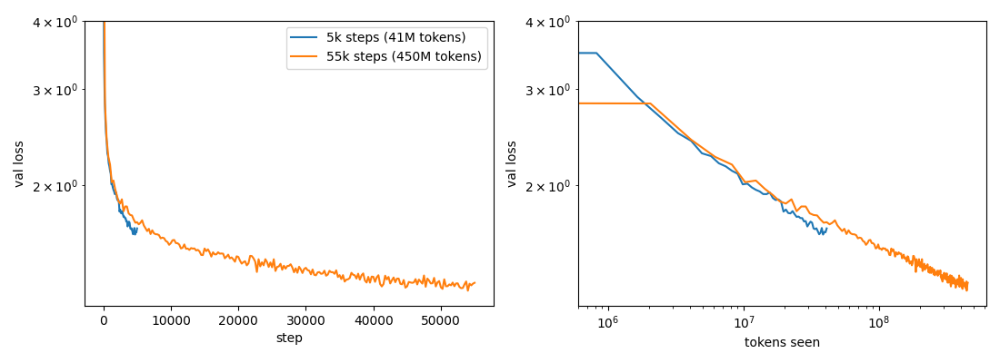
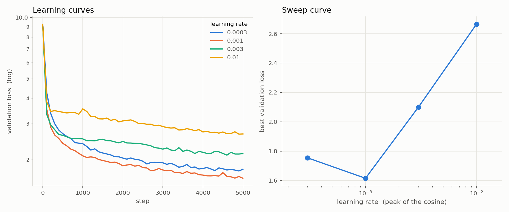
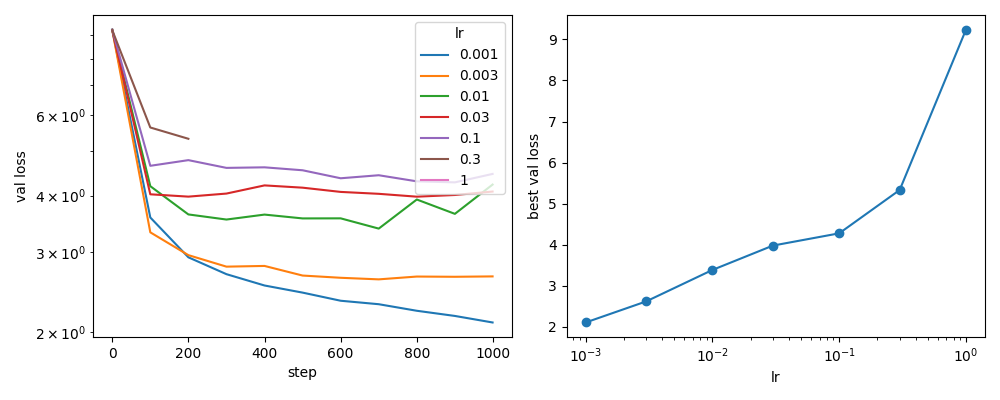
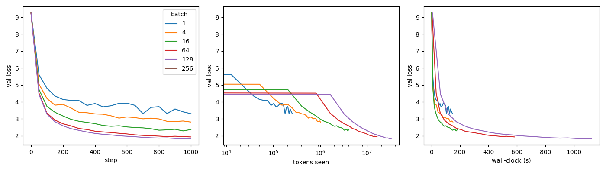
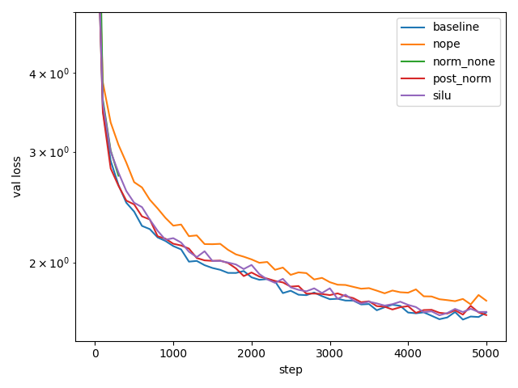

# lm-from-scratch

A language model built from scratch, following the arc of Stanford's
[CS336: Language Modeling from Scratch](https://stanford-cs336.github.io/) and its
Assignment 1. The premise of the course is that you understand a system by building
every piece of it yourself, so nothing here is imported from a library beyond raw
tensors: the byte-level BPE tokenizer (trained on TinyStories and OpenWebText), every
layer of the decoder-only Transformer — linear, embedding, RMSNorm, SwiGLU, RoPE,
scaled dot-product attention, multi-head attention, the pre-norm block, the full LM,
the cross-entropy loss — and the training machinery around it: AdamW, the cosine
schedule with warmup, gradient clipping, the random-window data loader, and
checkpointing. Everything is written directly on `torch.nn.Module` and `torch.optim.Optimizer`,
with no `nn.Linear`, `nn.Embedding`, `nn.LayerNorm`, `nn.functional`, or `torch.optim.AdamW`
shortcuts, and each piece is checked against the assignment's reference tests.

## Results

### Tokenizer

Byte-level BPE with GPT-2 pre-tokenization, parallel pre-tokenization across
document boundaries, and incremental pair-count updates during merging.

| corpus | tokenizer | bytes/token | tokens/pretoken |
|---|---|---:|---:|
| TinyStories | TinyStories 10K | 4.03 | 1.003 |
| OpenWebText | OpenWebText 32K | 4.25 | 1.093 |
| OpenWebText | TinyStories 10K | 3.17 | 1.467 |
| TinyStories | OpenWebText 32K | 3.91 | 1.033 |

Cross-tokenizing degrades compression asymmetrically: a broad vocabulary degrades
gracefully on narrow text (−3%), a narrow one degrades sharply on broad text (−25%).
Full write-up: [`experiments/TOKENIZER_EXPERIMENTS.md`](experiments/TOKENIZER_EXPERIMENTS.md).

### Model

22.7M parameters: d_model 512, 4 layers, 16 heads, SwiGLU d_ff 1344, context 256,
vocabulary 10,000, RoPE θ = 10,000. Trained with AdamW (β = 0.9/0.999, weight decay
0.01), a cosine schedule with 100 steps of warmup decaying to a 1e-4 floor, and
gradient clipping at global norm 1.0. All runs below are on one A100 MIG slice (3g.20gb).

Best validation loss **1.280** — perplexity 3.60, or 1.85 bits per token — after 55,000
steps at batch 32 on TinyStories, 3.8 hours. That is 450M tokens, roughly 20 per
parameter, the compute-optimal budget for a model this size.

A prompted sample (`Temp=0.7 Topp=0.9`, prompt in bold):

> **Long long time ago.** One day, a little girl named Lily came to the garden. She saw
> the green plant and said, "Hello, Mr. Vong! Why are you so sad?" The green plant told
> her, "I am sad because I am dry and not pretty like the other plants." […] One day, a
> big storm came. The green plant was scared. Lily knew what to do. […] From that day
> on, the green plant was not sad anymore. It was happy to have a friend to help it.



The first run of this model used 5,000 steps (41M tokens) and reached 1.615 — 9% of the
compute-optimal token budget, and the single biggest error in the project. Eleven times
more data, nothing else changed, bought 1.615 → 1.280. The curve is still descending at
55,000 steps, so the model is data-limited rather than capacity-limited even here.

| budget | tokens | val loss | perplexity |
|---|---:|---:|---:|
| 5,000 steps | 41M | 1.615 | 5.03 |
| **55,000 steps** | **450M** | **1.280** | **3.60** |

The difference is visible in the samples: both models write fluent sentences, but the
5,000-step one loses track of state across paragraphs — a girl searches a park by
looking "under the bed, behind the couch, and even in the toy box".

#### Learning rate, and the edge of stability

The peak learning rate was chosen by a four-point sweep at the 5,000-step budget:
3e-4 → 1.755, **1e-3 → 1.615**, 3e-3 → 2.100, 1e-2 → 2.665.



Folk wisdom says the best learning rate sits just below the point where training
diverges. It does not, here. Pushing the peak rate upward until a run blew up:

| schedule | smallest divergent lr | η_div / η\* |
|---|---:|---:|
| warmup + cosine + clip 1.0 | 5e-1 (diverged at step 124) | ~500 |
| constant lr, clipping off | 3e-1 (diverged at step 257) | ~300 |



Between 3e-3 and 2e-1 — two orders of magnitude — training is perfectly stable and
monotonically worse. Removing warmup, decay and clipping moved the cliff by less than a
factor of two, so the gap is a property of AdamW rather than of the schedule: the update
is η·m̂/√v̂ ≈ ±η per coordinate, the gradient magnitude cancels, and the sharp
2/λ_max threshold behind the folklore (a gradient-descent result) never bites.

#### Batch size

Batch 1 to the memory limit, fixed 1,000-step budget, lr 1e-3:

| batch | val loss | wall-clock | s/step |
|---|---:|---:|---:|
| 1 | 3.307 | — | — |
| 4 | 2.813 | 2m41 | 0.16 |
| 16 | 2.375 | 3m12 | 0.19 |
| 64 | 1.936 | 9m51 | 0.59 |
| 128 | 1.831 | 18m53 | 1.13 |
| 256 | out of memory | — | — |



At a fixed step count, bigger is better — trivially, since batch 128 sees 128× the data.
The useful column is the last one: going from batch 4 to 16 costs 19% more time for 4×
the data, while 16 → 64 costs 3.1× and 64 → 128 costs 1.9×. The GPU is idle below batch
~16 and saturated above ~64, so small batches do not save time, they waste the machine.

#### Architecture ablations

Each component removed in turn, 5,000 steps at lr 1e-3, everything else identical:

| variant | val loss |
|---|---:|
| baseline (pre-norm, RMSNorm, RoPE, SwiGLU) | **1.622** |
| SwiGLU → SiLU FFN (d_ff = 4·d_model) | 1.647 |
| pre-norm → post-norm | 1.649 |
| RoPE → NoPE (no positional encoding) | 1.715 |
| RMSNorm removed | diverged at step 300 |



Normalization is the only component that is load-bearing at this scale. Without RMSNorm
the model is broken at initialization — validation loss 18.1 at step 0 against ln(10000)
= 9.21 for a uniform predictor — because nothing rescales the residual stream as it
grows layer by layer. The other three cost between 0.03 and 0.09 nats. NoPE is the
interesting one: it is worse, but it still learns, which is the Kazemnejad result — a
causal decoder can infer position from the mask alone.


## Architecture

<!-- TODO: the module map — every component in order with tensor shapes and the
     governing equation. Source of truth for the from-memory rebuilds. -->

```
tokens (B, T)
  └─ Embedding                       (B, T, d_model)
  └─ × num_layers Transformer_block
       ├─ RMSNorm → MultiheadSelfAttention (+RoPE on Q, K) → residual
       └─ RMSNorm → SwiGLU FFN                              → residual
  └─ RMSNorm
  └─ Linear (LM head)                (B, T, vocab_size)
```

Conventions worth knowing: linear weights are stored `(in, out)` and applied as
`x @ W` (no transpose in forward); RoPE pairs adjacent components; the causal mask
is built per call from the sequence length.

## Layout

```
tokenizer/    bpe.py, bpe_multiprocessing.py — training;  tokenizer.py — encode/decode
model/        model.py — all modules + softmax, attention, cross-entropy
training/     optim.py — AdamW;  schedule.py — cosine LR schedule with warmup;  clip.py — gradient clipping;  data.py — random-window batch loader;  checkpoint.py — save/load
experiments/  tokenizer experiments, arXiv corpus builders (API and Kaggle dump), corpus → uint16 token-ID encoding, and the trained vocabularies
data/         corpora and encoded token IDs (gitignored): TinyStories valid .txt/.npy, sample_50MB.txt
train.py      training loop: memmap data, warmup+cosine LR, clipping, checkpoints, CSV logging
generate.py   sampling from a checkpoint: temperature, top-p (nucleus), <|endoftext|> stop
sweep.sh      learning-rate sweep launcher (sequential, one GPU)
sweep_batch.sh  batch-size sweep launcher (fixed step budget, one GPU)
ablate.sh     architecture ablations: no-norm, post-norm, NoPE, SiLU-FFN
tests/        pytest suite for the training utilities (mirrors the CS336 checks)
drills/       timed from-memory rebuilds of the whole model (practice notebooks, not library code)
```

## Running

```bash
pip install -r requirements.txt
python experiments/tokenizer_experiments.py       # reads data/ (TinyStories + OWT valid files)
python experiments/encode_datasets.py               # TinyStories valid, 50 MB sample, train → uint16 .npy (skips existing)
python experiments/fetch_arxiv.py                   # arXiv hep-ph abstracts → data/arxiv_hepph_{train,valid}.txt in TinyStories layout
python experiments/fetch_arxiv.py --year 2019       # one submission year (the API paginates to 10k results per query)
python experiments/arxiv_from_kaggle.py hep-ph      # every hep-ph abstract, from the Kaggle metadata dump in data/ (no API calls)
python experiments/train_arxiv_bpe.py               # BPE over the arXiv abstracts → experiments/arxiv_hepph_vocab10000.json
python -m pytest tests/                            # schedule, clipping, data loader, checkpointing
```

```bash
python train.py Nrun=5000 Batch_size=32 Device=mps     # any setting at the top of train.py as key=value
python train.py LoadCkpt=True                            # resume from the checkpoint, append to the CSV log
python generate.py Prompt="Once upon a time" Temp=0.7 Topp=0.9 Ckpt_path=checkpoints/tinystories55k.pt
bash sweep.sh probe ; bash sweep.sh                      # LR sweep on one GPU (see the header for the SWAN recipe)
python experiments/plot_sweep.py                         # logs/lr*.csv → experiments/lr_sweep.png
LRS="2e-2 5e-2 1e-1 2e-1" LOGDIR=logs_edge bash sweep.sh   # edge of stability: push lr until a run diverges (CLIP=1e9 to see it undamped)
bash sweep_batch.sh ; python experiments/plot_batch.py    # batch 1..256 at fixed lr → batch_sweep.png (steps / tokens / wall-clock)
bash ablate.sh ; python experiments/plot_ablate.py         # the four §7.3 ablations vs the baseline
```

Training writes `checkpoints/<name>.pt` (model + optimizer + step, resumable) and
`logs/<name>.csv` (step, train loss, val loss, lr, wall-clock) — both gitignored.

## Provenance

The structure and the problem sequence follow Stanford CS336 Assignment 1
(spring 2026 handout); the code is my own. The assignment's test harness (28 tests:
tokenizer, BPE training, every model component, AdamW, LR schedule, gradient
clipping, data loading, checkpointing) passes against this code. The assignment
repo itself is not included here — only the implementations.
